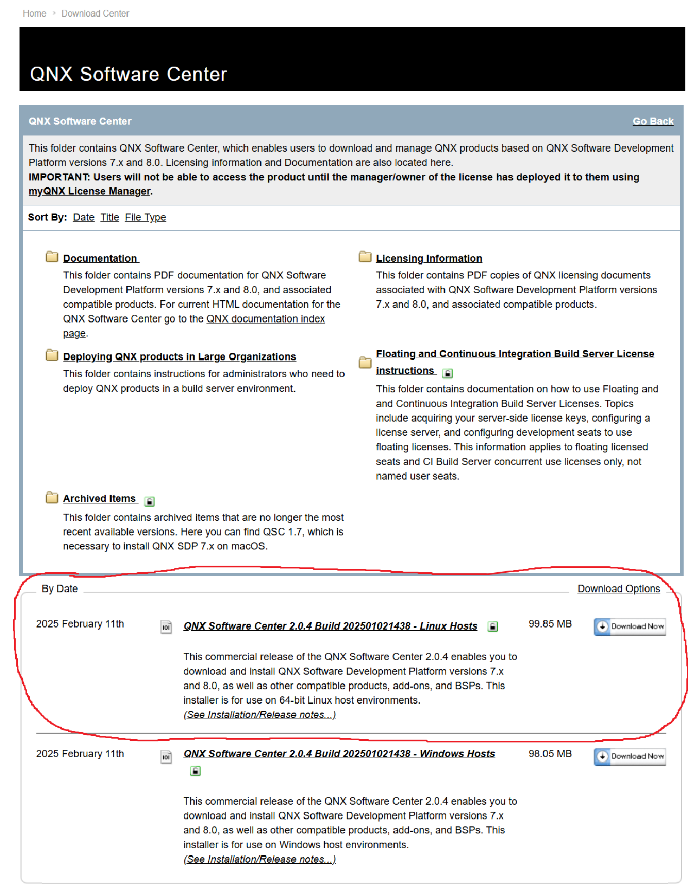
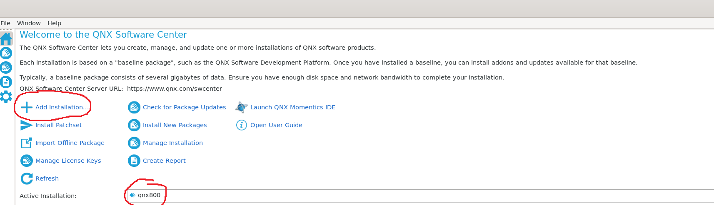
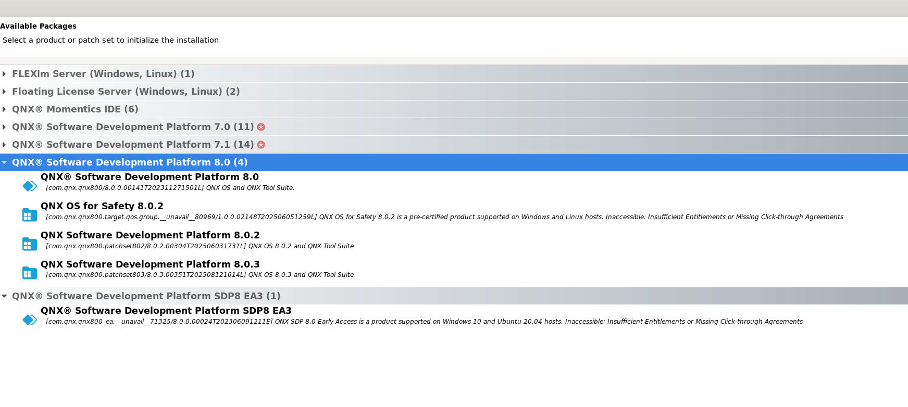
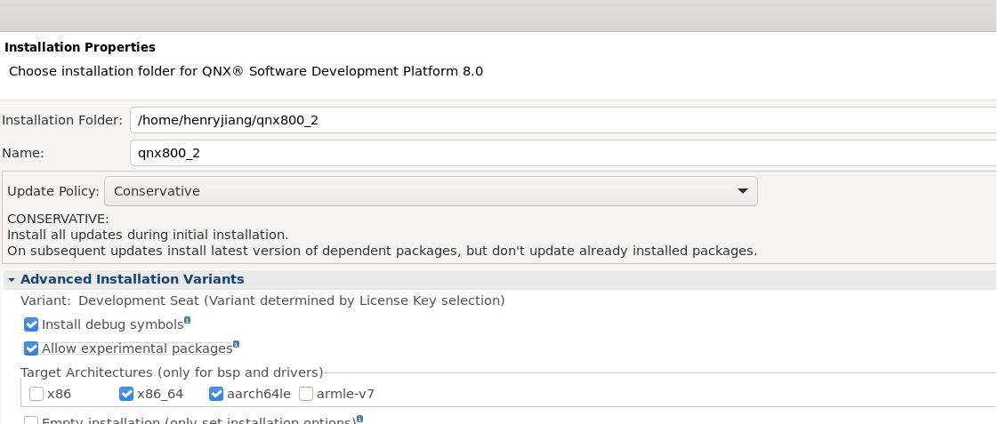
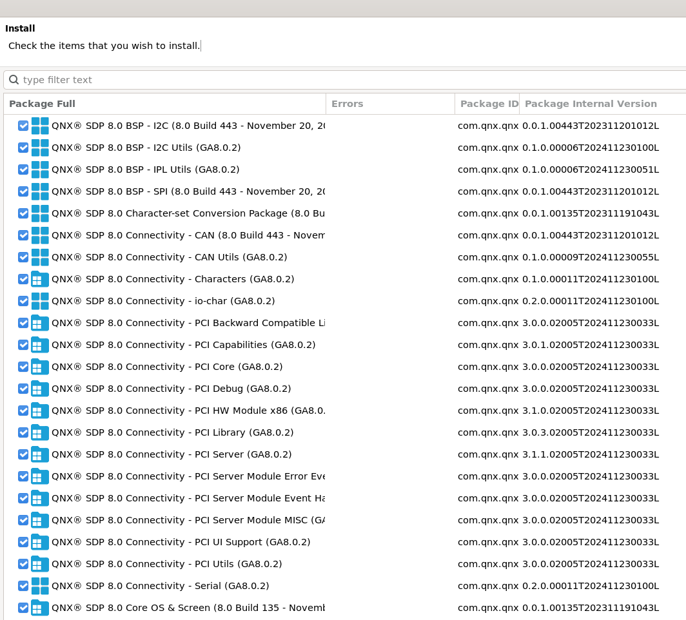
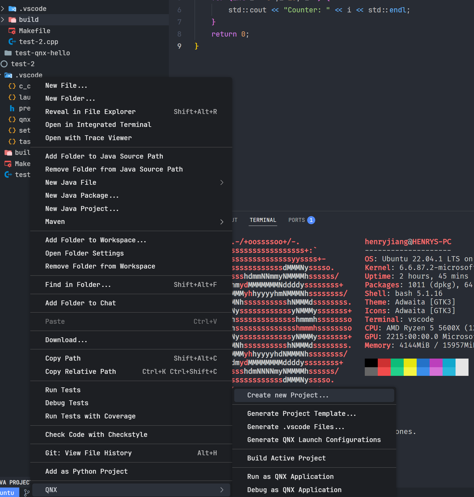
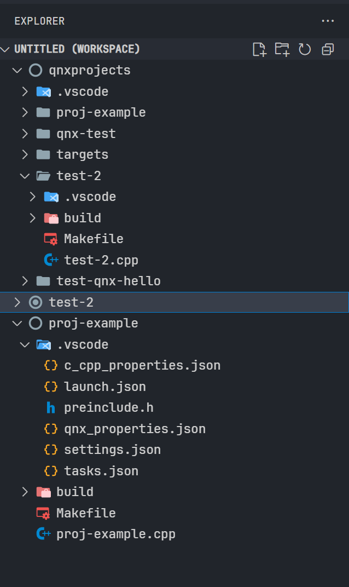

# QNX Setup Repository


This repo is a comprehensive setup guide to get QNX OS 8.0 to run on WSL2 or macOS using **VSCode**.  While SR8's main computer will have alot more functionality provided (hopefully) through SDK's (e.g. driveOS SDK, DriveWorks SDK), it is still important to familiarise yourself with (what is hopefully) SR8's production environment.

This repository provides step-by-step instructions, configuration files, and automated setup scripts to help developers quickly establish a working QNX development environment across different platforms.

It is important to note that this repo only guide you on how to setup QNX to run locally on your host machine via a VM. To setup, deploy and test code using an actual QNX Target (e.g. on a Raspberry Pi 4), shoot me a message and I'll tell you how to do it (once I figure out how to do it) or wait for the git repo I will put out lol

This guide will also target how to build and deploy code to an virtual **ARM (aarch64le)** based QNX Image, as the NVIDIA Drive Thor and Raspberry Pi 4 run ARM-Based CPUs/SoCs.

It is also important to note that development on QNX is a bit finnicky on VSCode, and as NVIDIA might have its own application development environment (it has one for CUDA that is built for Visual Studio or VSCode), it is best to at least be used to how to use VSCode to write applications for QNX even though this workflow will probably not be correct for SR8-EMBD-v2 (hehe).

## Supported Platforms

- **macOS** - QNX development setup for Apple Silicon and Intel Macs
- **Windows WSL** - QNX development environment within Windows Subsystem for Linux
- **Windows 10/11**: If you are using Windows 10/11, just download the SDP + Momentics IDE and follow the tutorials found [here](https://www.youtube.com/watch?v=s8_rvkSfj10&t).

## Requirements
Before continuing, please ensure you have the following downloaded:
- WSL Extension for VSCode
- Java Runtime 17 (required for the System Profiler)
- Bash as your main shell for WSL2
- CMake (for CMake project types)
- Installation of Microsoft Visual Studio Code (of course)
- Ubuntu 20.04, Ubuntu 22.04, or Red Hat Enterprise Linux 9
- QEMU. You can use VMWare, VirtualBox or QVM, but this repo will use QEMU.

## INITIAL SETUP

First, if you want your own license, please acquire a free QNX License by making an account and following the steps [here](https://devblog.qnx.com/how-to-get-a-free-qnx-license/). You can use Embedded's license (my license) by searching for "QNX Account Login" in the 25T3 Embedded Chat. If you can't find it, shoot me a message (Hint: password is the workshop's wifi password)

Setup process has been taken from QNX's own devblogs. If you are lost or confused any time during this guide, consult the full devblogs for [WSL](https://devblog.qnx.com/using-qnx-with-wsl2/) and [macOS](https://devblog.qnx.com/how-to-use-macos-to-develop-for-qnx-8-0/).
### WSL2
If you want to run QNX on WSL, we first need to download the QNX Software Center **INSIDE** WSL2. To do this:

1. Log in to the QNX website and download the QNX Software Center for Linux Hosts package



2. Start Ubuntu (WSL) and execute the following commands (assuming you downloaded the QNX Software Center to the 'Downloads' directory):

```bash
cd $HOME
cp /mnt/c/Users/<username>/Downloads/qnx-setup-<version>-linux.run .
chmod +x qnx-setup-<version>-linux.run
./qnx-setup-<version>-linux.run
```
Make sure to change anything in <> to your windows username, and  to the version that you downloaded.

3. You will be prompted to read and accept the DEVELOPMENT LICENSE AGREEMENT.

Finally, if you accepted the default installation directory, the QNX Software Center will be installed at `$HOME/qnx/qnxsoftwarecenter.`

### macOS
to add later
- Download software centre for macOS
- Download docker
- download homebrew


## IDE + SDP Install
Per the devblog, there are two ways to download the IDE and SDP: using the GUI or CLI. If you want to use the IDE + WSL or install via the CLI, watch the tutorial on how to use the momentics IDE [here](https://www.youtube.com/watch?v=s8_rvkSfj10&t) or read the full devblog mentioned at the beginning. This guide will only show how to install QNX 8.0 SDP using the GUI.

# SDP INSTALL

### WSL ONLY
If QNX Software Centre is not running right now, run it with the following commands (assuming that it has been installed at the default directory)

```bash
cd qnx/qnxsoftwarecenter
./qnxsoftwarecenter
```

### macOS ONLY
TODO:
- Run and build the docker container
- mount hard drive onto docker container and shit (maybe make anything built on the container gets sent back as well? or use container ssh directly that way)

##
Upon startup, login to QNX Software Centre with either your own account or the Sunswift Developer Account.

To download QNX SDP 8.0, upon landing on the home page, click **add installation**. Also ensure that your active installation is qnx800 on the bottom as well


Select the QNX Software Development Platform 8.0 Dropdown, and select QNX SDP 8.0, 8.0.2, 8.0.3, etc.



In the next page for installation properies, click the advanced installation variants and allow for experimental packages and select target architectures to be x86_64 and aarch64le (ARM)



Upon determining which packages to install for QNX, just install everything (everything should be checked anyways)



After this, click the finish button and start the install of the SDP. If you can't see the finish button, resize the window with  `win + ↑`.

### [NOTE]
Even with all the checkboxes installed, you still might find yourself unable to create a virtual QNX image. To get by this, click the `Install New Packages` button on the landing page and download anything related to `ARM` or `aarch64` (type aarch64 in the type text search bar). I'm not sure what I downloaded to fix this, but I could generate aarch64 QNX images after downloading this package. If you still can't generate a QNX image after the specified package has been installed, please message me individually or the group chat.

Upon finishing, you should now have QNX's SDP installed locally. To check, source the `env-sdp.sh` file found in your install location. The command using the default install location would look as follows:

```bash
source /home/<user>/qnx800/qnxsdp-env.sh
```
Note: For macOS users, this should have been done automatically upon startup of the docker container, but if it not, source it with the respective path in which this file is found in the docker container.

The outputted return should look as follows (for macOS, might look slightly different):
```bash
QNX_HOST=/home/<user>/qnx800/host/linux/x86_64
QNX_TARGET=/home/<user>/qnx800/target/qnx
MAKEFLAGS=-I/home/<user>/qnx800/target/qnx/usr/include
```
Running the command `qcc` should provide us with the following return:
```bash
cc: no files to process
```
QNX's SDP has been successfully installed if you can see the above message in your terminal, meaning that you are now ready to develop and compile code that can be deployed onto a real or virtual target.

## VSCode SDP Toolchain Install

To install the QNX SDP Toolchain for VSCode, run the following commands:
```bash
code --install-extension ms-vscode.cpptools
code --install-extension eclipse-cdt.vscode-trace-extension
code --install-extension qnx.qnx-vscode
```
After you havea installed the above extensions, open VSCode and open settings (either UI or the .json file).

If you are using the UI, search `@ext:qnx.qnx-vscode`

Setup the `SDP PATH` setting to the following:
- WSL: `/home/<user>/qnx800/`
- macOS: `/Users/<user>/qnx800`

To manually add this to your `settings.json` file, looks as follows:
- `"qnx.sdpPath": "/home/<user>/qnx800/"` (WSL)
- `"qnx.sdpPath": "/Users/<user>/qnx800/"` (macOS)

`[macOS]`: You might see an error message (bottom right) showing Error: /Users/username/qnx800/host/darwin/x86_64 is not a directory . You can ignore this for now since it shouldn't affect any of the steps needed to build your project.

Your host should be now ready to cross-compile for QNX Targets with the QNX Toolchain.

## Developing and Building QNX Code on VSCode
**[NOTE]**: As Application code for QNX is just C/C++ Code with some extra libraries (essentially), you can definitely just make a empty directory and code as if it were a normal C/C++ project. Making a new project in QNX abstracts away launch configurations (recursive make, Simple makefile, QNX CMake) and sets it all up for you. If you want to make a project/application this way, please read the relevant QNX Docs.

### WSL
To create a QNX-Project (Equivalent to a ROS2 Package) on VSCode using QNX's own toolchain, right click the file explorer, hover over QNX, and select "Build New QNX Project"

[NOTE]: Source the QNX SDP Environment on the terminal that you open VSCode with. I think the extension does this anyway when it opens a workspace though (need more time to investigate this).



After clicking this, you should be prompted with selecting a project name. Choose any name, and select (for this example) build options of `simple makefile`, `cpp`, and `exectuable`. This should then generate a QNX-Project in a new workspace in VSCode (which you can save).

**All projects built this way will be saved in `/qnxprojects`**.


Writing code for QNX is then as simple as writing a C/C++ Application. Once you have finished, right click the workspace and click `Build Active Project` to build/rebuild your QNX Application. A successful build will have a QNX Debugger Output that looks like the following:

```zsh
 *  Executing task in folder proj-example: make BUILD_PROFILE=debug PLATFORM=aarch64le all 

q++ -Vgcc_ntoaarch64le_cxx -c -Wp,-MMD,build/aarch64le-debug/./proj-example.d,-MT,build/aarch64le-debug/./proj-example.o -o build/aarch64le-debug/./proj-example.o  -Wall -fmessage-length=0 -fPIC -g -O0 -fno-builtin  proj-example.cpp
q++ -Vgcc_ntoaarch64le_cxx -o build/aarch64le-debug/proj-example   build/aarch64le-debug/./proj-example.o  
 *  Terminal will be reused by tasks, press any key to close it. 
 ```
**NOTE**: If you do not want to build the project using QNX's own toolchain, You can directly compile the code with q++ or qcc with the correct arguments, or by running a makefile (I would recommend this as its most similar to what wew have learnt in Uni + makes sense for larger projects)


 Once this is done, we can now deploy this code onto a QNX Target to run.

 ### macOS
 - Fuck me in the ass this is going to take a while
 - Workflow --> Dev containers (from old ROS2 projects) --> Mount and Source QNX instead of sourcing ROS2. Build code manually with q++ args, or maybe set QNX's tool chain to look at QNX within WSL and build that way? (need to test)
 - Once built, then scp onto VM
 - TLDR i finna shoot myself

 ## Deploying Applications/Code to a QNX Target
 In the QNX Extension on the side bar of VSCode there is a QNX Targets section which would allow us to either create/run/connect to a QNX Target. **This only really works if the QNX Target has an IP Address**, and is not recommended for use unless your QNX Target has a working IP Address. To get a IP address to the VM in WSL, its really messy and might require a reboot of your entire system, so it is not recommended to use these features of the QNX Toolchain on VSCode :(

 Instead, we will be creating a QNX Target on a VM (QEMU). QEMU was mainly chosen because of its ability to run QNX on aarch64 (most if not all of our boards that we will run QNX on will be ARM-based rather than x86_64 based).

## Download QEMU
### macOS
To download QEMU on macOS, use homebrew:
```zsh
brew install qemu
```
### WSL
```bash
# note: only downloading qemu for arm emulation, download qemu-system-x86_64 if you want x86_64 emulation as well
sudo apt update
sudo apt install -y qemu-system-arm bridge-utils net-tools libvirt-clients libvirt-daemon-system
```

### Creating a QNX Image
We will be using `mkqnximage` to create a virtual QNX OS Image to run on QEMU. Documentation can be found [here.](https://www.qnx.com/developers/docs/8.0/com.qnx.doc.neutrino.utilities/topic/m/mkqnximage.html)

To create the QNX Image, run the script found in `wsl-setup` (ASSUMES DEFAULT INSTALL PATH)
```bash
chmod +x <PATH>/qnx-setup/generate-aarch64le-qnx.sh
./generate-aarch64le-qnx.sh
```
This script will generate a Virtual QNX-Target in the location where one would have been generated using the SDP Toolchain in VSCode. It also copies `run.sh` to this folder, which can be used to boot the VM if it has been given permission.

If you are having trouble making your qnx image or would like to put the image elsewhere, ensure you have sourced `qnxsdp-env.sh` and run the following command in an empty directory:
```bash
mkqnximage --type=qemu --arch=aarch64le --hostname=qnx-a64 --build
```

### Running the QNX Image
We will be using QEMU to run this generated QNX Image. Run `run.sh` to startup the emulator in a new terminal.
```bash
cd qnxprojects/targets/qemu-qnx800-aarch64le
chmod +x ./run.sh
./run.sh
```
[NOTE]: The run script forwards port 2222 to allow for copying/sshing into the virtual target.

If have moved the install to a different location or want to boot the VM with different parameters, the use the following command (what is found in `run.sh`) as a reference.


```bash
qemu-system-aarch64 \
    -machine virt-4.2 \
    -cpu cortex-a57 \
    -smp 2 \
    -accel tcg \
    -m 1G \
    -drive file=output/disk-qemu.vmdk,if=none,id=drv0 \
    -device virtio-blk-device,drive=drv0 \
    -netdev user,id=net0,hostfwd=tcp::2222-:22,hostfwd=tcp::8000-:8000 \
    -device virtio-net-device,netdev=net0,mac=52:54:00:b4:ae:64 \
    -pidfile output/qemu.pid \
    -nographic \
    -kernel output/ifs.bin \
    -serial mon:stdio \
    -object rng-random,filename=/dev/urandom,id=rng0 \
    -device virtio-rng-device,rng=rng0 \
    -nographic
```
### Deploying and Running Code on the QNX Image

There are multiple ways to deploy code onto a QNX Target. As this workflow is in its infacy stage, the guide will only cover simple methods used to deploy code onto a QNX target. Further deployment methods will be discussed as this development workflow matures.

### [OPTIONAL]: SSHing into the QNX VM
You are also able to SSH into the QNX Virtual Target if you want (this is more applicable for physical targets like a RPI).

[NOTE]: I am a bit unfamiliar with SSH and do not know why I still need a password even though I turned off password authentication for the QNX Image. If anybody wants to/is bothered to fix feel free but right now I have listed a workaround

1. In your QNX VM Terminal, setup a password for the qnx image with `passwd`. You will be prompted to put in a password twice.
2. In another terminal, `ssh` into the QNX Target. The required password is the one that you just set.
```bash
ssh -p 2222 root@127.0.0.1
```
Upon login, you will be in directory `/data/home/root`


#### Method 1: SCP
Using `scp`, we can copy target files/directories and upload them directly onto the emulated target. **FOLLOW STEP 1** in SSHing into the QNX VM before running this command.

```bash
scp -P 2222 ./file-name root@127.0.0.1:/location/
```

Below is a reference example of how to use scp to copy a file onto the qnx virtual target

```bash
# copy a file --> copies a file named my-project into the /tmp/ on the qnx image
scp -P 2222 ./my-project root@127.0.0.1:/tmp/

# copy a directory (recursive) --> copies folder named my-project into /data/ on the qnx virtual target
scp -P 2222 -r ./my-project root@127.0.0.1:/data/
```
You can then run your compiled application on the virtual target as if it were a normal C/C++ application.


