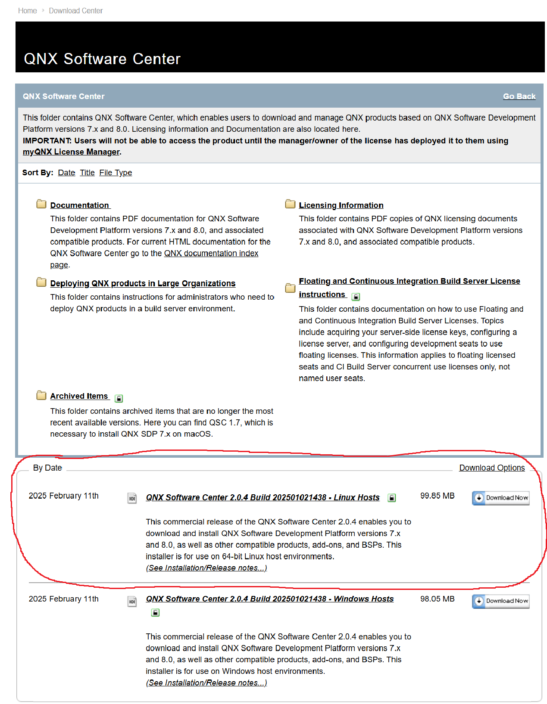
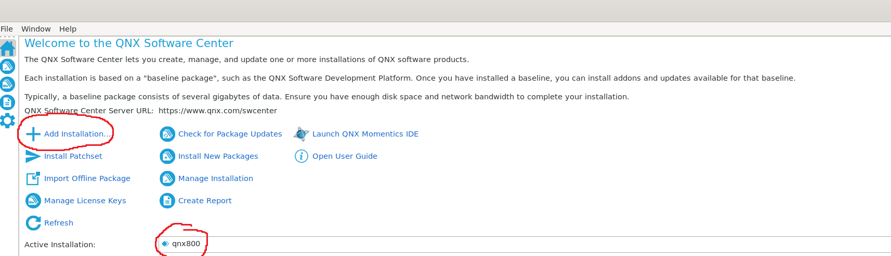
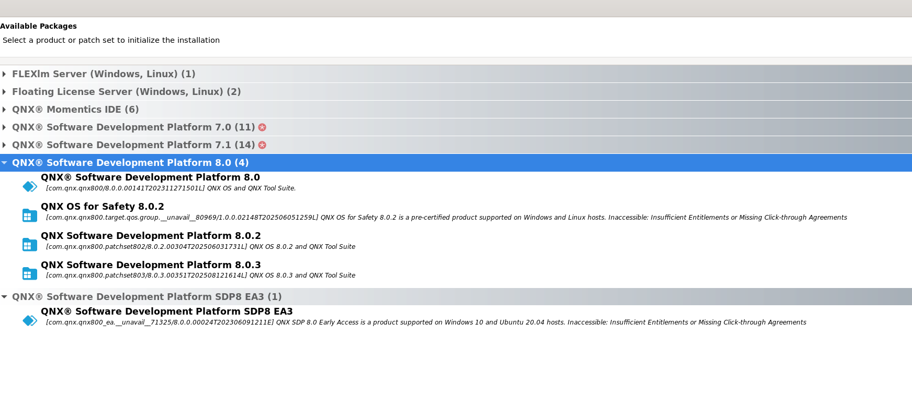
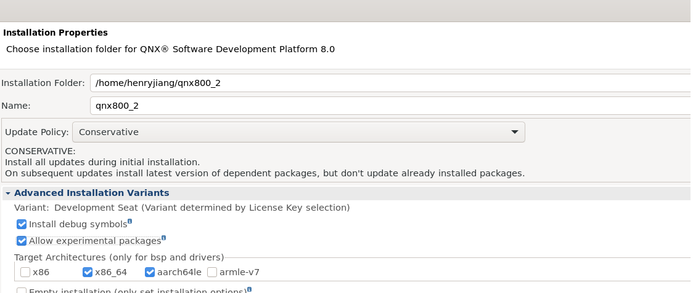
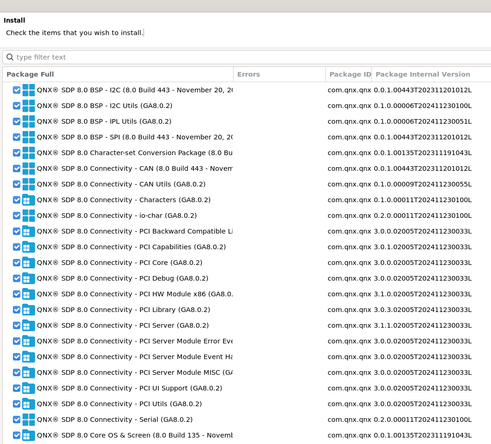
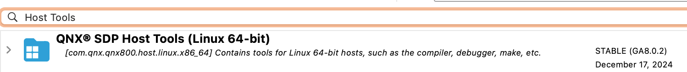
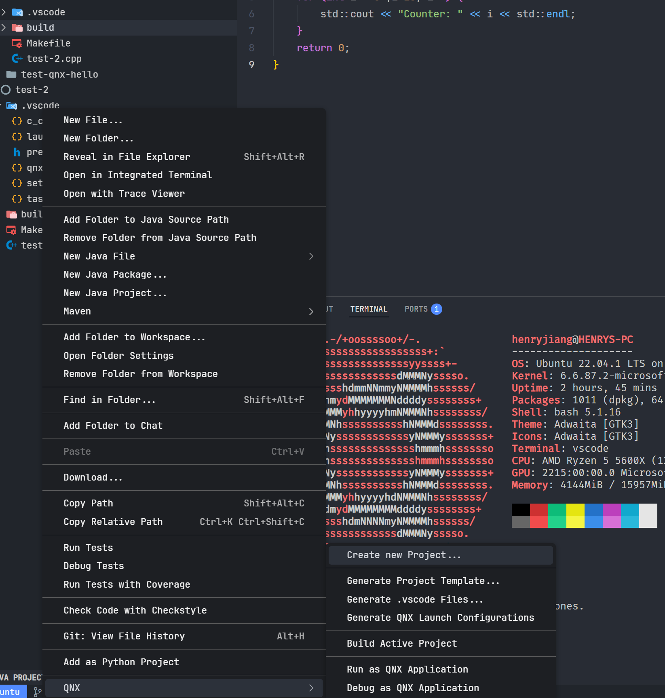
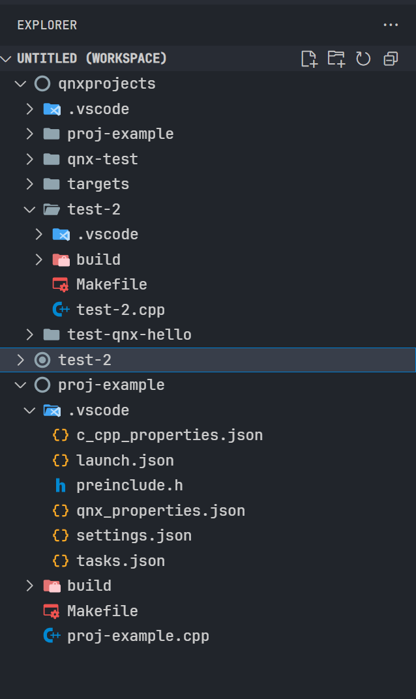

# QNX Setup (WSL2 + macOS)

This guide walks you through installing **QNX SDP 8.0**, setting up **VS Code**, and creating/running an **ARM (aarch64le)** virtual target with QEMU. It focuses on two supported hosts:

- **Windows WSL2** (Ubuntu 20.04/22.04 or RHEL 9)
- **macOS** (Apple Silicon or Intel; uses Docker)

If you want to deploy to real hardware (e.g., Raspberry Pi 4), reach out separately.

---

## What you’ll need
- A QNX account/license (free: follow [these steps](https://devblog.qnx.com/how-to-get-a-free-qnx-license/); team login details are in the 25T3 Embedded chat).
- Visual Studio Code installed.
- Java Runtime 17 (for the System Profiler).
- CMake (for CMake-based projects).
- Bash shell (WSL2).
- QEMU (we standardise on QEMU; VMware/VirtualBox also work if you adjust `mkqnximage` args).
- Docker (macOS only).

Helpful references from QNX:
- [WSL2 devblog](https://devblog.qnx.com/using-qnx-with-wsl2/)
- [macOS devblog](https://devblog.qnx.com/how-to-use-macos-to-develop-for-qnx-8-0/)

---

## Step 1: Install QNX Software Center

### WSL2
1. Log in to the QNX website and download the **QNX Software Center for Linux Hosts**.  
   
2. In WSL, run (replace `<username>` and `<version>`):
   ```bash
   cd $HOME
   cp /mnt/c/Users/<username>/Downloads/qnx-setup-<version>-linux.run .
   chmod +x qnx-setup-<version>-linux.run
   ./qnx-setup-<version>-linux.run
   ```
3. Accept the development license. Default install path: `$HOME/qnx/qnxsoftwarecenter`.

### macOS
1. Install [Docker Desktop](https://docs.docker.com/desktop/setup/install/mac-install/).
2. Download the **QNX Software Center for macOS** from the [official page](https://www.qnx.com/download/feature.html?programid=58068) (or the Sunswift SharePoint mirror).
3. Install Homebrew (used later):
   ```bash
   /bin/bash -c "$(curl -fsSL https://raw.githubusercontent.com/Homebrew/install/HEAD/install.sh)"
   ```

---

## Step 2: Install QNX SDP 8.0 (GUI)
If QNX Software Center isn’t already running:
- **WSL2**:
  ```bash
  cd $HOME/qnx/qnxsoftwarecenter
  ./qnxsoftwarecenter
  ```
- **macOS**: launch the downloaded installer and open QNX Software Center.

Then, in QNX Software Center:
1. Sign in (your own account or the Sunswift developer account).
2. Click **Add Installation** and ensure the active installation name is `qnx800`.  
   
3. Choose **QNX Software Development Platform 8.0** (e.g., 8.0, 8.0.2, 8.0.3).  
   
4. On **Installation Properties**, expand **Advanced installation variants**, allow experimental packages, and select target architectures **x86_64** and **aarch64le (ARM)**.  
   
5. Keep all packages selected and click **Finish** to install.  
   If the Finish button is hidden, resize the window (`Win + ↑`).  
   

### macOS: add Linux Host Tools
After SDP is installed:
1. Go to **Manage Installation** → **Available**.
2. Search for **Host Tools** and install **QNX SDP Host Tools (Linux 64-bit)**.  \
   

> If you cannot create an aarch64 image later, return to **Install New Packages** in QSC and install any `ARM`/`aarch64` items.

---

## Step 3: Validate the environment
Source the SDP environment script (adjust the path for your username):
```bash
source /home/<user>/qnx800/qnxsdp-env.sh       # WSL2
source /Users/<user>/qnx800/qnxsdp-env.sh      # macOS (inside Docker)
```
Expected output (paths will match your user):
```
QNX_HOST=/home/<user>/qnx800/host/linux/x86_64
QNX_TARGET=/home/<user>/qnx800/target/qnx
MAKEFLAGS=-I/home/<user>/qnx800/target/qnx/usr/include
```
`qcc` should respond with:
```
cc: no files to process
```

---

## Step 4: Set up VS Code
Install the extensions:
```bash
code --install-extension ms-vscode.cpptools
code --install-extension eclipse-cdt.vscode-trace-extension
code --install-extension qnx.qnx-vscode
```
Then set **SDP Path**:
- WSL2: `/home/<user>/qnx800/`
- macOS (Docker): `/Users/<user>/qnx800`

In `settings.json`:
```json
"qnx.sdpPath": "/home/<user>/qnx800/"   // WSL2
"qnx.sdpPath": "/Users/<user>/qnx800/"  // macOS
```
macOS may warn about `/host/darwin/x86_64` missing; it’s safe to ignore for container workflows.

---

## Step 5: Create and build a project (WSL2)
1. Open VS Code (from a terminal that already sourced `qnxsdp-env.sh`).
2. Right-click the Explorer → **QNX** → **Build New QNX Project**.  
   
3. Pick a name and options (e.g., `simple makefile`, `cpp`, `executable`). Projects are created under `/qnxprojects`.  
   
4. Build via **Build Active Project**. A successful build shows:
   ```zsh
    *  Executing task in folder proj-example: make BUILD_PROFILE=debug PLATFORM=aarch64le all
   q++ -Vgcc_ntoaarch64le_cxx -c ...
   q++ -Vgcc_ntoaarch64le_cxx -o build/aarch64le-debug/proj-example ...
    *  Terminal will be reused by tasks, press any key to close it.
   ```
You can also compile with `q++`/`qcc` or a Makefile directly.

---

## Step 6: Build a QNX VM image
We use `mkqnximage` to create an **aarch64** image for QEMU.

### Install QEMU
- **macOS**:
  ```zsh
  brew install qemu
  ```
- **WSL2**:
  ```bash
  sudo apt update
  sudo apt install -y qemu-system-arm bridge-utils net-tools libvirt-clients libvirt-daemon-system
  ```

### Generate the image (WSL2)
From the repo:
```bash
chmod +x wsl-setup/generate-aarch64le-qnx.sh
./wsl-setup/generate-aarch64le-qnx.sh
```
This places the image where the VS Code extension would have created it and copies `run.sh` there.

If you prefer manual creation (after sourcing `qnxsdp-env.sh`), run in an empty directory:
```bash
mkqnximage --type=qemu --arch=aarch64le --hostname=qnx-a64 --build
```

### Generate the image (macOS via Docker)
1. Build the Docker image (first time only):
   ```bash
   cd mac-setup
   chmod +x ./docker-build-qnx-image.sh
   ./docker-build-qnx-image.sh
   docker compose up -d --no-build
   ```
2. Open a shell in the container:
   ```bash
   docker exec -it qnx-build bash
   ```
3. Ensure the environment is sourced:
   ```bash
   source /home/<your_docker_username>/qnx800/qnxsdp-env.sh
   ```
4. Create the image:
   ```bash
   mkdir -p qnxprojects/targets/qemu-qnx800-aarch64le && cd qnxprojects/targets/qemu-qnx800-aarch64le
   mkqnximage --type=qemu --arch=aarch64le --hostname=qnx-a64 --build
   ```
5. Copy `run.sh` from `mac-setup` into this directory.

---

## Step 7: Run the VM
From the target directory:
```bash
cd qnxprojects/targets/qemu-qnx800-aarch64le
chmod +x ./run.sh
./run.sh
```
`run.sh` forwards port **2222** for SSH/SCP. If you need custom options, start QEMU directly:
```bash
qemu-system-aarch64 \
  -machine virt-4.2 \
  -cpu cortex-a57 \
  -smp 2 \
  -accel tcg \
  -m 1G \
  -drive file=output/disk-qemu.vmdk,if=none,id=drv0 \
  -device virtio-blk-device,drive=drv0 \
  -netdev user,id=net0,hostfwd=tcp::2222-:22,hostfwd=tcp::8000-:8000 \
  -device virtio-net-device,netdev=net0,mac=52:54:00:b4:ae:64 \
  -pidfile output/qemu.pid \
  -nographic \
  -kernel output/ifs.bin \
  -serial mon:stdio \
  -object rng-random,filename=/dev/urandom,id=rng0 \
  -device virtio-rng-device,rng=rng0 \
  -nographic
```

---

## Step 8: Deploy code to the VM
### SSH (optional)
1. In the VM console, set a password if using a non-root user:
   ```bash
   passwd
   ```
2. From your host:
   ```bash
   ssh -p 2222 <user>@127.0.0.1
   ```
   (Root login at 127.0.0.1 requires no password by default.)

### Copy files with SCP
```bash
# copy a file to /tmp on the VM
scp -P 2222 ./my-project root@127.0.0.1:/tmp/

# copy a directory to /data on the VM
scp -P 2222 -r ./my-project root@127.0.0.1:/data/
```
Then run your compiled binaries on the VM like a normal C/C++ app.

For physical targets, replace `127.0.0.1` with the device IP (`ifconfig`, interface `vtnet0` is typical) and adjust the port if needed.

---

## macOS Dev Container notes
- The QNX VS Code extension does not work perfectly inside Dev Containers; consider using `q++`/`qcc` or Makefiles directly.
- If you want to scaffold a QNX project with the extension, do it outside the container, then reopen the folder in Dev Containers.
- To change the project root for the extension, edit **Default Projects Root** in VS Code settings.

---

## Troubleshooting checklist
- Can’t create an aarch64 image: in QNX Software Center, install additional `ARM`/`aarch64` packages via **Install New Packages**.
- Missing `qnxsdp-env.sh` variables: re-source the script and confirm paths in the output.
- Finish button not visible in QSC: resize the window (`Win + ↑`).
- macOS path warning about `/host/darwin/x86_64`: safe to ignore for Docker workflows.
